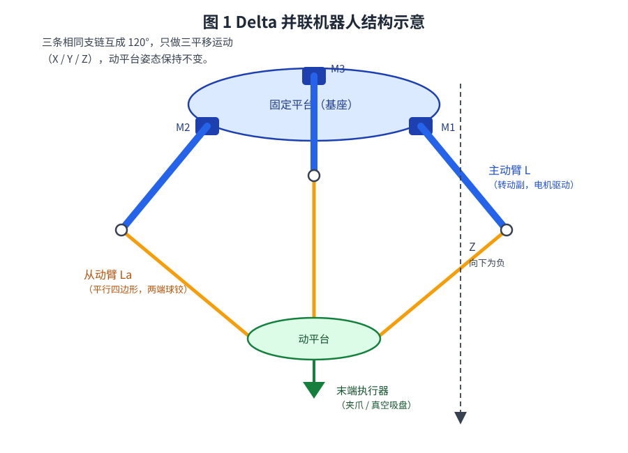
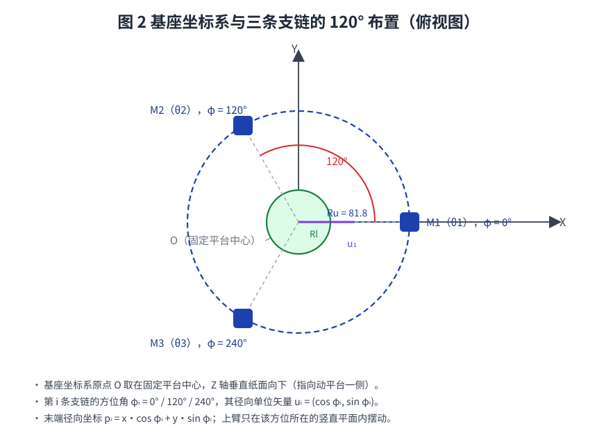
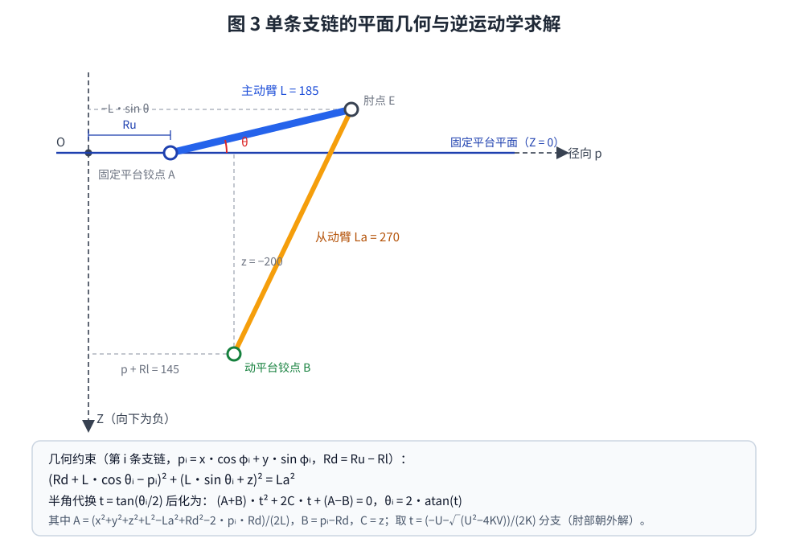
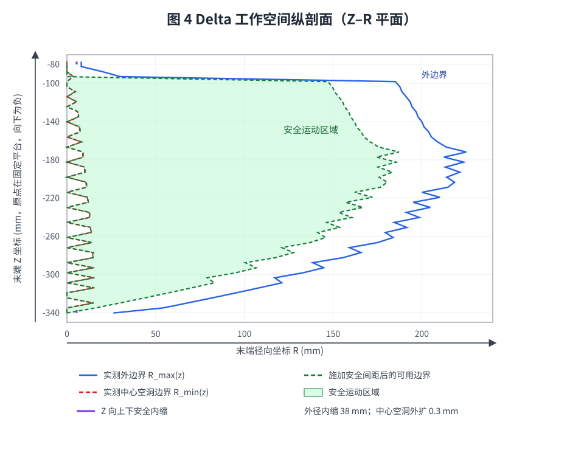
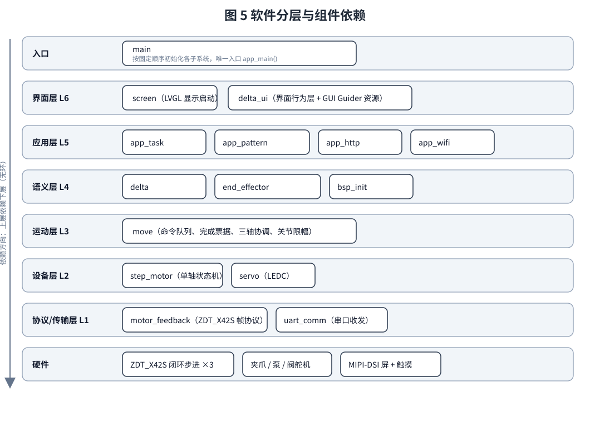
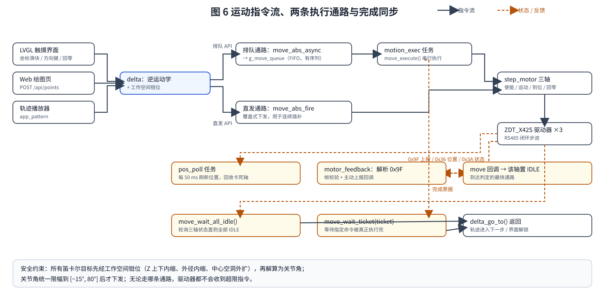

# Delta 机器人控制器（ESP32-P4）

并联 Delta 机器人主控固件。目标板为 **WT99P4C5-S1**（ESP32-P4 + ESP32-C5 协处理器），
负责三轴闭环步进的协调运动、Delta 逆运动学、末端夹爪/真空泵控制、LVGL 触摸界面，
以及一个内置的 Web 绘图页面（浏览器画图 → 机器人复现轨迹）。


---

## 1. 硬件与目标

| 项目 | 配置 |
| --- | --- |
| 主控 | ESP32-P4，16 MB Flash，32 MB PSRAM（200 MHz） |
| 显示 | MIPI-DSI 1024×600，GT911 电容触摸 |
| 运动 | 3 × ZDT_X42S 闭环步进，RS485 半双工 |
| 电机总线 | `UART_NUM_1`，RX = GPIO5，TX = GPIO4，115200 8N1，地址 0x01/0x02/0x03 |
| 执行器 | 夹爪舵机 GPIO6、真空泵 GPIO36、泄压阀 GPIO33（LEDC，50 Hz） |
| 网络 | ESP32-P4 无原生 Wi-Fi；经 `esp_hosted` + `esp_wifi_remote` 驱动板载 **ESP32-C5** 协处理器 |

机械参数（在 `components/delta/delta.c` 中定义）：

```
上平台半径 Ru = 81.8 mm    下平台半径 Rl = 25.0 mm
上臂长度   L  = 185.0 mm   下臂连杆   La = 270.0 mm
工作空间 Z ∈ [-340.26, -77.10] mm（另加安全内缩）
```

---

## 2. Delta 机器人运动原理

### 2.1 机械构型与自由度

Delta 机器人是一种**三自由度平动并联机构**。它由三条**完全相同**的运动支链连接固定平台
（基座）与动平台（末端），三条支链在水平面内**互成 120°** 均匀分布：

* 每条支链的**主动臂**（上臂，长度 `L`）由固定在基座上的伺服/步进电机通过**转动副**直接驱动；
* 主动臂末端（肘点）通过**平行四边形从动臂**（连杆，长度 `La`，两端为球铰）连到动平台；
* 平行四边形结构约束了动平台的姿态，使其只能做 **X / Y / Z 三个方向的平移**，不能旋转。

因此机器人只有 3 个自由度，对应 3 个主动臂转角 θ₁、θ₂、θ₃。
只要给定末端目标点 (x, y, z)，就能唯一确定（在同一装配分支上）三个关节角——这就是**逆运动学**。



### 2.2 坐标系与关节角约定

工程内统一采用如下约定（见 `components/delta/delta.c`）：

* **原点 O** 位于固定平台中心；**Z 轴竖直向下**（指向动平台一侧为正方向）。
  工作空间在基座下方，所以代码中的目标 Z 都是**负值**（例如绘图平面 `z = -248 mm`、抬笔 `z = -200 mm`）。
* 第 i 条支链的**方位角** φᵢ = 0° / 120° / 240°，其径向单位矢量 **uᵢ = (cos φᵢ, sin φᵢ)**。
* 末端点在支链 i 方向的**径向坐标**：

  ```
  pᵢ = x·cos φᵢ + y·sin φᵢ
  ```

* **关节角 θᵢ** 定义为主动臂相对**水平面**的夹角；本工程约定 θᵢ 为正时肘点位于基座平面**下方**。
* 关节角统一限幅为 **[−15°, 80°]**（`move.c` 的 `ANGLE_MIN` / `ANGLE_MAX`），超出即钳位并打印告警。



### 2.3 逆运动学推导

设固定平台半径 `Ru`、动平台半径 `Rl`、主动臂长 `L`、从动臂长 `La`，并记

```
Rd = Ru − Rl
```

对第 i 条支链，取该支链方位所在的**竖直平面**（径向为横轴、竖直向上为纵轴）：

* 主动臂的回转中心（基座铰点）Aᵢ 在该平面内距中心轴 `Ru`；
* 肘点 Eᵢ 距中心轴 `Ru + L·cos θᵢ`，相对基座平面的高度为 `−L·sin θᵢ`；
* 动平台铰点 Bᵢ 距中心轴 `pᵢ + Rl`，高度为 `z`（负值，在基座下方）。

从动臂是刚性连杆，长度恒为 `La`，于是得到**唯一的几何约束**：

```
(Rd + L·cos θᵢ − pᵢ)² + (L·sin θᵢ + z)² = La²
```



展开并整理成 `cos θ` 与 `sin θ` 的线性组合：

```
B·cos θᵢ − C·sin θᵢ = A
A = (x² + y² + z² + L² − La² + Rd² − 2·pᵢ·Rd) / (2L)
B = pᵢ − Rd
C = z
```

再用**半角代换** `t = tan(θᵢ / 2)`（此时 `cos θ = (1−t²)/(1+t²)`、`sin θ = 2t/(1+t²)`），
方程化为标准一元二次方程：

```
(A + B)·t² + 2C·t + (A − B) = 0
即  K·t² + U·t + V = 0 ,   K = A+B ,  U = 2C ,  V = A−B
```

求根并还原角度：

```
t = (−U − √(U² − 4KV)) / (2K)        θᵢ = 2·atan(t)
```

* 判别式 `U² − 4KV < 0` 表示该点**不可达**（`solve_leg()` 返回失败，调用方报 `ESP_ERR_INVALID_ARG`）。
* 二次方程一般有两个根，对应「肘部朝外 / 朝内」两种装配位形；本工程取**肘部朝外**的分支
  （上式中的负号根），与机械实际装配一致。
* 代码里 `delta.c` 为三条腿分别写出了 `A/B/C`，其中第 2、3 条腿的系数整体放大了 2 倍
  （`A/L`、`−2Rd − t`、`2z`）。因为 `K、U、V` 同倍缩放不改变 `t` 的根，所以与上面的通式等价。

> 直观理解：三条支链各自给出一个「主动臂必须摆到哪个角度，连杆才能够到目标点」的方程，
> 三个方程彼此独立（都只依赖末端坐标 x、y、z），因此可以并行、闭式求解——这也是 Delta 机构
> 速度快、刚度高的原因。

终端读者可参考下面的单腿示意：

```
        基座平面 (Z = 0)
   O──────────────A──────────────► 径向 p
   │               \
   │  Ru            \  主动臂 L（转角 θ）
   │                 \
   │                  E  肘点
   │                   \
   │  z（负，向下）      \  从动臂 La
   │                     \
   ▼                      B  动平台铰点
   Z                        （距中心轴 p + Rl）
```

### 2.4 工作空间与安全约束

由于连杆干涉与关节行程限制，Delta 的有效工作空间**不是一个简单圆柱**：

* 在靠近中心轴的位置，三根连杆会互相干涉，形成一块**中心空洞**（半径下界 `R_min(z)`）；
* 在外侧，主动臂角度接近极限，存在**外边界** `R_max(z)`；
* 两个边界都随高度 z 变化。

工程把工作空间按 Z 均分为 **50 层**，逐层实测并保存 `R_max(z)`、`R_min(z)` 两张半径表
（`delta.c` 中的 `s_workspace_r_max[]` / `s_workspace_r_min[]`），运行时对 z 做**线性插值**得到当前层边界。
在此基础上再施加安全间距，保证不会把关节拉到硬极限：

| 间距 | 值 | 作用 |
| --- | --- | --- |
| `SAFETY_MARGIN_Z` | 3.0 mm | Z 向上下各内缩 |
| `SAFETY_MARGIN_R_MAX` | 38.0 mm | 外边界向内收缩，避免关节极限 |
| `SAFETY_MARGIN_R_MIN` | 0.3 mm | 中心空洞向外扩张，避免连杆干涉 |



**钳位算法**（`clamp_to_workspace()`）顺序固定：

1. 先把 z 限制到 `[Z_MIN+3, Z_MAX−3]`；
2. 用插值得到该层的 `R_max`、`R_min`，并施加安全间距得到 `R_max_safe`、`R_min_safe`；
3. 计算当前 XY 半径 `R = √(x²+y²)`：
   * `R > R_max_safe`：沿径向按比例缩回；
   * `R < R_min_safe`：沿径向按比例推出（若恰好落在原点，则推到 X 轴正方向）；
4. 任何一次钳位都会打印 `WARNING` 日志，注明原始值与修正值，便于回溯是哪个调用点越界。

所有运动入口（触摸界面、Web 接口、轨迹播放）都会经过这**同一处**钳位，因此不存在绕过安全检查的通路。

### 2.5 关节角 → 脉冲 / 编码器换算

* 主动臂角 → 电机轴角：乘以减速比 `GEAR_RATIO = 2.5`（50/20）；
* 电机角 → 脉冲：`脉冲 = 电机角 / 360° × PULSES_PER_REV`，其中 `PULSES_PER_REV = 3200`（16 细分）；
* 绝对位置指令使用脉冲数，方向由脉冲符号决定；
* 反馈侧：驱动器提供 16 位编码器（寄存器 `0x36`）、状态标志（`0x3A`，其中 `Prf_TF` 位表示到位）、
  以及运动结束主动上报帧 `0x9F`。

### 2.6 运动方式与轨迹生成

| 方式 | 说明 | 代码入口 |
| --- | --- | --- |
| 关节空间点到点 | 三个关节角一次性下发，三轴同时启动、各自到达 | `move_abs()` / `delta_go_to()` |
| 笛卡尔连续插补 | 把笔划离散成密集点，逐点解算后**覆盖式**下发，由驱动器内部队列连续执行 | `move_abs_fire()` / `delta_go_to_async()` |
| 抬笔 / 落笔 | 同一 XY 在不同 Z 之间切换（绘图平面 ↔ 安全高度） | `app_pattern` |

> 注意：本工程**没有**实现笛卡尔直线插补（旧版的 `delta_move_linear` 已删除）。
> 若需要末端走严格直线，可在 `delta` 层按固定步长把直线分段，再逐段调用
> `delta_go_to_queue()`；无需恢复旧的轮询等待实现。

---

## 3. 目录结构

```
delta/
├── CMakeLists.txt              # 顶层工程（project: delta）
├── partitions.csv              # nvs / phy_init / factory(9M)
├── sdkconfig.defaults          # 精简后的默认配置（含 Wi-Fi 账号）
├── dependencies.lock           # 组件管理器锁定文件
├── README.md                   # 本文件
├── docs/                       # 原理与架构配图（SVG）
├── main/
│   ├── CMakeLists.txt
│   ├── idf_component.yml
│   └── main.c                  # 唯一入口，只负责「按顺序初始化」
└── components/
    ├── uart_comm/              # L1 通用串口收发（驱动 + RX 任务 + 回调）
    ├── motor_feedback/         # L1 ZDT_X42S 协议层（组帧/校验/解析/0x9F 通知）
    ├── step_motor/             # L2 单轴状态机（使能/运动/到位/回零/置零）
    ├── servo/                  # L2 LEDC 舵机驱动
    ├── move/                   # L3 三轴协调（队列、执行器、完成票据、限幅）
    ├── delta/                  # L4 逆运动学 + 工作空间约束
    ├── end_effector/           # L4 夹爪 / 真空泵 / 泄压阀
    ├── bsp_init/               # L4 板级装配（创建上面所有硬件句柄）
    ├── app_task/               # L5 位置轮询任务 + 运动执行器任务
    ├── app_pattern/            # L5 多笔划轨迹播放器
    ├── app_http/               # L5 内置 Web 绘图页 + REST 接口
    ├── app_wifi/               # L5 Wi-Fi STA 接入与网络服务启动
    ├── screen/                 # L6 LVGL 显示启动
    ├── delta_ui/               # L6 界面行为层 + GUI Guider 生成资源
    │   ├── delta_ui.c
    │   ├── include/
    │   ├── generated/          # GUI Guider 生成（不再手工修改）
    │   ├── images/
    │   └── fonts/
    └── wt99p4c5_s1_board/      # 板级支持包（厂商提供，原样保留）
```

---

## 4. 分层与依赖关系

依赖是**无环有向图（DAG）**，下层不知道上层的存在：

```
  main
   ├── bsp_init ──┬── uart_comm ── motor_feedback ── step_motor
   │              └── end_effector ── servo
   ├── move ───────── step_motor / motor_feedback
   ├── delta ──────── move
   ├── app_task ───── move / step_motor / bsp_init
   ├── app_wifi ───── app_http ── app_pattern ── delta / move
   └── screen ─────── delta_ui ── delta / move / end_effector
                        └──────── wt99p4c5_s1_board (BSP)
```



| 层 | 组件 | 职责 |
| --- | --- | --- |
| L1 传输/协议 | `uart_comm`, `motor_feedback` | 字节流收发、帧解析与校验 |
| L2 设备 | `step_motor`, `servo` | 单个执行器的状态与控制 |
| L3 运动 | `move` | 三轴排队调度、完成同步、关节限幅 |
| L4 语义 | `delta`, `end_effector`, `bsp_init` | 笛卡尔运动、末端动作、板级装配 |
| L5 应用 | `app_task`, `app_pattern`, `app_http`, `app_wifi` | 任务、轨迹、Web、网络 |
| L6 界面 | `screen`, `delta_ui` | LVGL 显示与交互 |

> 旧工程中 `bsp_init → app_task → bsp_init`、`move → delta → move` 等循环依赖已全部消除：
> 全局句柄只由 `bsp_init` 创建，运动子系统的队列/事件组归 `move` 所有，
> `delta` 只依赖 `move`，`move` 不再反向依赖 `delta` 或 `bsp_init`。

---

## 5. 启动流程（`main/main.c`）

```c
ESP_ERROR_CHECK(bsp_init());        // 1. UART1 + 协议层 + 3 个轴 + 末端执行器
ESP_ERROR_CHECK(move_init(g_motor_fb, g_motors));
                                    // 2. 建队列/信号量，注册 0x9F 回调，使能三轴
ESP_ERROR_CHECK(move_home_all(STEP_MOTOR_HOME_NEAREST, 2000));
                                    // 3. 三轴回零并等待稳定
delta_init();                       // 4. 设定笛卡尔参考点
ESP_ERROR_CHECK(app_tasks_start()); // 5. 位置轮询任务 + 运动执行器任务
ESP_ERROR_CHECK(app_wifi_start());  // 6. Wi-Fi 异步连接（拿到 IP 再起 HTTP/播放器）
ESP_ERROR_CHECK(screen_init());     // 7. LVGL 显示 + 界面
```

初始化顺序的约束与原工程一致，但现在**显式且可检查**（每一步都返回 `esp_err_t`），
不再依赖「先 `app_rtos_init()` 再 `bsp_init()` 否则回调崩溃」这种隐式约定。

---

## 6. 运动控制与并发模型



### 6.1 两条运动通路

| 通路 | API | 特点 | 使用者 |
| --- | --- | --- | --- |
| 排队 | `move_abs` / `move_abs_async`（`delta_go_to` / `delta_go_to_queue`） | 串行、有序、可等待 | UI 按钮、回零、置零、轨迹起落笔 |
| 直发 | `move_abs_fire`（`delta_go_to_async`） | 立即下发、不排队、允许覆盖 | 图案连续插补（`app_pattern`） |

### 6.2 队列 + 完成票据（ticket）

* `move_init()` 创建 `g_move_queue`（容量 256）、`s_submit_mutex`、计数信号量 `s_done_sem`。
* 提交命令时在互斥锁内**同时**分配自增 `ticket` 并入队，保证「票据顺序 == 队列顺序」。
* `app_task` 中的 `motion_exec_task` 逐条取出，调用 `move_execute()` 执行到底，然后
  `complete_ticket()` 唤醒等待者。
* 阻塞式 `move_abs()` = 入队 + `move_wait_ticket(ticket, timeout)`。

这样**调用者等待的一定是自己那条命令**，不同命令之间不会互相“冒领”完成信号。
（旧实现让执行器与调用者同时 `xEventGroupWaitBits(..., xClearOnExit=pdTRUE)` 抢同一组事件位，
高优先级执行器先清除位，导致阻塞调用几乎必然超时——该竞态已移除。）

### 6.3 到位判定（三级）

1. **0x9F 主动上报**：驱动器运动结束时回 `addr, func, 0x9F, 0x6B`，
   `motor_feedback` 解析为主动上报，`move` 的回调直接把该轴置为 IDLE（最快）。
2. **0x3A 状态位 Prf_TF**：`step_motor_update_position()` 读取，bit1 置位即到位。
3. **编码器容差兜底**：位置与目标脉冲折算值之差在 `POS_TOLERANCE_ENC` 内。

`move_wait_all_idle()` 轮询三轴状态（5 ms 粒度）；超时后再读一次位置并强制复位卡死轴，
保证调用者不会被一次丢失的上报永久阻塞。

### 6.4 任务

| 任务 | 核心 | 优先级 | 职责 |
| --- | --- | --- | --- |
| `pos_poll` | Core 0 | 8 | 每 50 ms 刷新编码器位置；每 5 s 回收长时间 RUNNING 的轴 |
| `motion_exec` | Core 0 | 10 | 消费 `g_move_queue`，串行执行命令 |
| `pattern` | 任意 | 8 | 轨迹拆分、降采样、连续下发 |
| `uart_rx` | 任意 | 10 | UART 字节流 → 协议帧 |
| `lvgl` | Core 1 | 4 | LVGL 刷新（由 esp_lvgl_port 创建） |

---

## 7. 各组件说明与关键 API

### `uart_comm` — 通用串口
安装 UART 驱动、创建 RX 任务、把收到的字节块交给回调。
`uart_comm_init()` / `uart_comm_send()` / `uart_comm_set_rx_callback()`。
RS485 方向由收发器硬件自动处理，本层不碰 DE/RE。

### `motor_feedback` — ZDT_X42S 协议
`motor_feedback_init()`、`motor_feedback_send_and_wait()`（互斥的命令-应答原子交换）、
`motor_read_register()`、`motor_feedback_register_callback()`。
校验支持固定 `0x6B` / XOR / CRC-8。帧长判定**先按功能码查表**，避免把寄存器读回的
数据字节误判成状态码；变长帧按第三字节长度或 `0x6B` 定位。

### `step_motor` — 单轴状态机
`step_motor_init()`、`set_enable()`、`move_to()`、`update_position()`、`homing()`、
`set_zero_position()`、`force_idle()`、一组 getter。
状态只有 `IDLE` / `RUNNING`（**已删除从未使用的同步触发模式及其全部配套代码**）。

### `move` — 三轴协调
持有三轴句柄、命令队列与完成机制，对外提供排队/直发两套 API（见 §6.1）。
`move_init(fb, motors)`、`move_abs*()`、`move_home_all()`、`move_enable/disable_motor()`、
`move_set_zero()`、`move_execute()`、`move_wait_ticket()`、`move_wait_all_idle()`。
关节角统一钳位到 `[-15°, 80°]`。

### `delta` — 逆运动学
`delta_init()`、`delta_go_to()`（排队+阻塞）、`delta_go_to_queue()`（排队不等待）、
`delta_go_to_async()`（直发，轨迹流）。
内部：解析法逆运动学（见 §2.3）、50 层工作空间半径表插值、外/内半径与 Z 向安全间距钳位。
所有越界请求都会打日志，便于回溯调用点。

### `end_effector` — 末端执行器
`end_effector_init()`、`end_effector_toggle_claw()`、`end_effector_toggle_pump()`。
把原来散落在 `delta.c` 里的夹爪/真空泵动作收敛到独立组件，`delta` 不再需要知道舵机的存在。

### `bsp_init` — 板级装配
创建 UART、协议句柄、三个 `step_motor` 与末端执行器，并导出：

```c
extern motor_feedback_handle_t g_motor_fb;
extern step_motor_handle_t     g_motors[3];
```

### `app_task` — 任务集
`app_tasks_start()`。只负责创建两个任务；RTOS 队列/事件组已下沉到 `move`。

### `app_pattern` — 轨迹播放
`pattern_player_init/load/abort/is_idle/progress`。
NaN 作为抬笔分隔符拆分笔划，长笔划降采样到 256 点，
笔划之间「等到位 → 抬笔 → 安全高度平移 → 落笔」，笔划内连续直发。
进度 `0..100` 供 `/status` 使用。双缓冲，新图案自动中止旧播放（最新请求优先）。

### `app_http` — Web 服务
内嵌单页绘图界面（Canvas 支持鼠标/触摸、速度与加速度滑块、发送/中止）。
路由：`GET /`、`GET /status`、`POST /api/points`、`POST /api/abort`。
服务端把二维笔划数组压平成一维点列（NaN 分隔）后交给播放器。

### `app_wifi` — 网络接入
`app_wifi_start()`。NVS → netif → STA → 连接；拿到 IP 后启动 HTTP 服务与轨迹播放器。
SSID/密码来自 **Kconfig**（`idf.py menuconfig` → *Delta 应用配置*），
可在 `sdkconfig.defaults` 中修改，不再硬编码在 `.c` 里。

### `servo` / `screen` / `delta_ui`
* `servo`：LEDC 50 Hz，脉宽按角度线性映射，角度钳位 `[0,180]`；`servo_init()` 现在**真正使用**
  `init_angle`（旧实现忽略该参数并固定写死 10°）。
* `screen`：全屏双缓冲、PSRAM、关闭软旋转；`setup_ui()` → `events_init()` →
  `delta_ui_init()`。旧工程**从未调用 `delta_ui_init()`**，自定义交互全部失效，现已接上。
* `delta_ui`：四个标签页的行为实现（坐标滑块、回零、夹爪/真空、轨迹画布、方向键点动、设置页），
  并把设置页的 speed/accel/timeout 真正接入运动参数。

---

## 8. 配置

* **`sdkconfig.defaults`**：目标、Flash、PSRAM/缓存、FreeRTOS 1000 Hz、LVGL 基础选项，
  **板载协处理器固定为 ESP32-C5**（`CONFIG_SLAVE_IDF_TARGET_ESP32C5` /
  `CONFIG_ESP_HOSTED_CP_TARGET_ESP32C5`，漏掉会落到组件默认的 C6 导致 Wi-Fi 起不来），
  以及 `CONFIG_DELTA_WIFI_SSID` / `CONFIG_DELTA_WIFI_PASSWORD`。
  已删除旧工程中**并不存在对应 Kconfig 的死配置项**（`CONFIG_EXAMPLE_LVGL_*`）
  以及未使用的 LVGL demo / sysmon / snapshot / imgfont 选项。
* **`sdkconfig`**：随工程附带，是从旧工程逐字节继承的**已验证硬件配置**（C5、SPIRAM 堆参数等），
  优先级高于 `sdkconfig.defaults`；不要用 `idf.py set-target` 重新生成它，除非确认 C5 选项仍在。
* **`components/app_wifi/Kconfig.projbuild`**：Wi-Fi 账号菜单。
* **`partitions.csv`**：`nvs(0x6000) / phy_init(0x1000) / factory(9M)`。
* **`managed_components/`**：已随工程附带，可离线构建（该目录被 `.gitignore` 忽略，属正常）。

---

## 9. 构建与烧录

```bash
. $HOME/esp/esp-idf/export.sh
cd delta
idf.py set-target esp32p4      # 首次
idf.py menuconfig             # 需要时修改 Delta 应用配置 -> Wi-Fi
idf.py build
idf.py -p /dev/ttyACM0 flash monitor
```

上电后串口日志会打印 Web 地址：`http://<ip>/`。

### 已验证

本工程已使用 **ESP-IDF v5.5**（`riscv32-esp-elf-gcc 14.2.0`）完整编译通过：

```
Project build complete.
delta.bin binary size 0x16e0b0 bytes (~1.43 MB)
Smallest app partition is 0x900000 bytes — 84% free
```

项目自身代码在此配置下**无编译警告**（`-Wall -Wextra`）；
`managed_components/` 已随工程附带，因此无需联网即可构建。

---

## 10. 相对旧工程的主要改动

### 10.1 结构

| 旧 | 新 |
| --- | --- |
| `bsp_init` 既建硬件又注册回调，反向依赖 `app_task` | 回调注册移入 `move`，`bsp_init` 只做装配 |
| `app_rtos_init()` 与 `move_init()` 分散建 RTOS 对象 | 队列/信号量统一由 `move_init()` 创建 |
| `delta.c` 混入 `move_*_async` 与舵机动作 | 拆分到 `move` 与新的 `end_effector` |
| `app_task` / `delta.h` 混杂运动命令类型定义 | `move_cmd_t` 等归 `move.h` |
| 任务与仓库耦合在 `app_task` | 保留 `app_task`，但只负责创建任务 |

### 10.2 删除（无引用）

* **整组件**：`app_mic`（INMP441，入口一直是注释状态）、`led`（仅声明未使用）。
* **函数**：`delta_move_linear`、`move_rel`/`move_global_sync`（只有声明）、
  `move_fb_test`/`motor_move_test`/`delta_test_move`/`motor_angle_test`、
  `step_motor_homing_with_detect`/`read_homing_status`/`abort_homing`/
  `notify_sync_started`/`global_sync_trigger`/`deinit`、
  `motor_feedback_deinit`/`wait_response`/`get_response`、
  `uart_comm_deinit`/`get_port`、`http_server_stop` 等。
* **状态/常量**：同步触发模式、无用的 `last_target_angle`、
  `PULSES_MIN/MAX`、`REACH_TOLERANCE`、`DELTA_MOVE_SAFE_*`、被注释的 `clamp_coord`、
  重复的状态赋值块、`app_http` 中兼容旧格式的 `points` 分支与两段空的日志循环。

### 10.3 修复的缺陷

| 位置 | 问题 | 处理 |
| --- | --- | --- |
| `screen.c` | `delta_ui_init()` 从未被调用，UI 交互全失效 | 启动时调用 |
| `move` | 执行器与调用者争抢同一事件位，阻塞调用必然超时 | 改为票据（ticket）+ 独立完成信号量 |
| `app_task` | `MOVE_CMD_SET_ZERO` 取错字段 `set_enable_motor_id` | 改用 `motor_id` |
| `servo.c` | `init_angle` 参数被忽略 | 实际使用 |
| `motor_feedback.c` | 4 字节判定可能把寄存器读回误判为应答帧 | 先按功能码判定帧类型 |
| `motor_feedback.c` | 把「数据不足」当成「帧非法」而丢字节 | 区分 `INCOMPLETE` / `INVALID` |
| `app_pattern.c` | 加载新图案时重复拷贝、无谓延时；重试分支恒不触发 | 简化为单次写入 + 中止旧播放 |
| `app_http.c` | `/api/points` 响应缺少 `stroke_count`，前端显示 undefined | 补齐字段 |
| `app_wifi.c` | 事件回调里 `ESP_ERROR_CHECK(esp_wifi_connect())` | 改为记录日志并重试 |
| `delta_ui.c` | 浮点用 `%d` 打印；设置页参数未生效；flex 子对象上无效的 `set_pos` | 修正格式、接入参数、移除无效调用 |
| `delta.c` | `isnan/isinf` 时 `return 1` 却返回未初始化的解 | 统一返回求解失败 |

---

## 11. 如需恢复被删除的功能

* **麦克风**：从旧工程取回 `components/app_mic/`，在 `main.c` 中调用 `inmp441_mic_start()`，
  并在 `main/CMakeLists.txt` 的 `REQUIRES` 中加 `app_mic`（注意 I2S 引脚 32/33/2 与舵机 GPIO33 冲突，需重新分配）。
* **LED**：取回 `components/led/`，在 `bsp_init` 中 `led_init()` 并新增任务即可。
* **同步触发运动**：`step_motor_move_to()` 的 `sync` 参数与同步等待状态已删；
  如确需多机同步，需同时恢复 `0x00 0xFF 0x66 0x6B` 广播触发与对应的状态通知。
* **直线插补**：如需笛卡尔直线，可在 `delta` 中按 `move_abs` 分段实现（见 §2.6 说明），
  无需恢复旧的轮询等待版本。

---

## 12. 代码规模（手写部分，不含生成资源）

| 组件 | 行数 | 组件 | 行数 |
| --- | --: | --- | --: |
| `app_http` | 706 | `move` | 631 |
| `app_pattern` | 388 | `motor_feedback` | 586 |
| `app_task` | 135 | `screen` | 96 |
| `app_wifi` | 131 | `servo` | 159 |
| `bsp_init` | 88 | `step_motor` | 450 |
| `delta` | 365 | `uart_comm` | 216 |
| `delta_ui` | 874 | `end_effector` | 150 |
| `main` | 49 | **合计** | **约 5 020** |

（不含厂商 BSP `wt99p4c5_s1_board/` 与 GUI Guider 生成的 `generated/`、`fonts/`、`images/`。
行数包含中文 Doxygen 注释。）

---

## 13. 配图清单（`docs/`）

| 图 | 文件 | 内容 |
| --- | --- | --- |
| 图 1 | [`docs/delta-structure.svg`](docs/delta-structure.svg) | Delta 机器人结构示意（三条支链、主动臂/从动臂、动平台） |
| 图 2 | [`docs/delta-coordinate.svg`](docs/delta-coordinate.svg) | 基座坐标系与三条支链的 120° 布置（俯视图） |
| 图 3 | [`docs/delta-ik-leg.svg`](docs/delta-ik-leg.svg) | 单支链平面几何与逆运动学方程 |
| 图 4 | [`docs/delta-workspace.svg`](docs/delta-workspace.svg) | 工作空间 Z–R 纵剖面与安全间距（由实测半径表生成） |
| 图 5 | [`docs/software-layers.svg`](docs/software-layers.svg) | 软件分层与组件依赖 |
| 图 6 | [`docs/motion-flow.svg`](docs/motion-flow.svg) | 运动指令流、两条执行通路与完成同步 |

> 图 4 由 `delta.c` 中的 50 层实测半径表直接生成，因此和代码中的工作空间数据严格一致；
> 其余为示意/几何图，标注的尺寸与代码中的机械参数一致。
